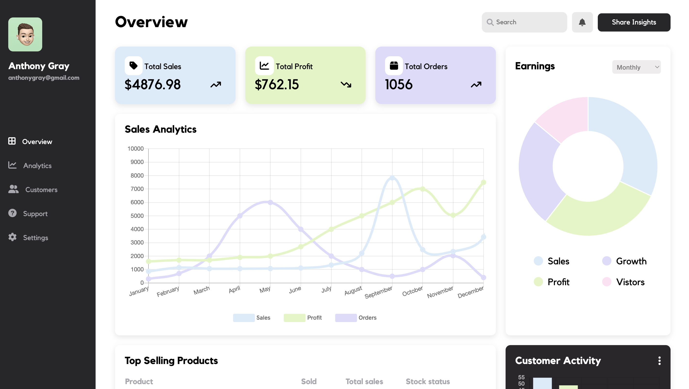

# Admin Dashboard 
An Admin Dashboard to practice complex layout techniques using CSS Grid. View it [here!](https://natasha-a.github.io/admin-dashboard/)

## Objective
* Utlilze CSS Grid components to create complex web layouts
* Develop strong understanding of how to position Grid elements
* Incorporate charts and graphs to present live data
* Responsive design for desktop and mobile views

## Sample Views 

## Learning Outcomes 
* Strong understanding of CSS Grid and properties  
* Advanced Grid properties practiced including `minmax()`, `clamp()`, & `auto-fill()`
* UX/UgtI concepts practiced for modern and cohesive dashboard  
* Responsive design using media queries and break-points
* Learned `Charts.js` to embed, style and customize live charts using array and object manipulation 

